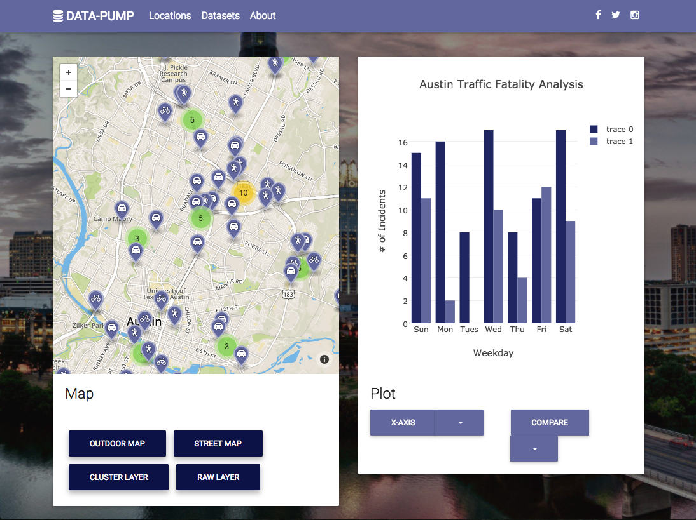

# data-pump [](https://circleci.com/gh/zenglenn42/data-pump)

With this second team project of the UT Full Stack Coding Bootcamp, we take a run at adding higher-order visulization to location-based traffic data.

## Landing Page


## Analytics Page



## Running Locally

Make sure you have [Node.js](http://nodejs.org/) and the [Heroku Toolbelt](https://toolbelt.heroku.com/) installed.

```sh
$ git clone git@github.com:zenglenn42/data-pump.git # or clone your own fork
$ cd data-pump
$ npm install
$ npm start
```
Your app should now be running on [localhost:8080](http://localhost:8080/).

## Deploying to Heroku

```
$ heroku create
$ heroku buildpacks:set heroku/nodejs
$ git push heroku master
$ heroku open
```
or

[](https://heroku.com/deploy)
